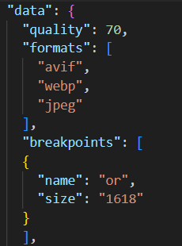

# portfoliov2
Personal portfolio website built with elm, elm-ui

## Install

Run npm for required packages

```npm install```

Run for gulp client

```npm install --global gulp-cli```

Download the elm installer

https://guide.elm-lang.org/install/elm.html

For the image generation feature, this may require removing the dependecy from package.json and running ``npm install`` before the next command.
    
```npm install --save-dev gulp-sharp-responsive```

## Build the source code

Source code is built and added to build folder using gulp command.

```gulp``` 

This command will run a live server and compile elm on changes, also some command for image generation is available, 
allowing to create different versions of images for sizes and formats.

## Build the elm code

The gulp task will run the following command to build the Elm code.

```elm make src/Main.elm --output build/main.js```

## Generate images

Generate the images with the command

```gulp tabImageOptimizerTask```

Define the desired configuration at galleryImages.json as shown:



## Resources

https://package.elm-lang.org/

https://package.elm-lang.org/packages/mdgriffith/elm-ui/